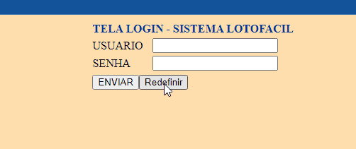

# Projeto Loto-Fácil.
## Sistema para geração de dezenas aleatórias
- Projeto solicitado por um amigo para gerar dezenas aleatórias, baseado em um estudo feito por ele.
- Para o estudo feito acima, criei um algoritmo e implementei em PHP.
- Gera números aleatórios baseado no último concurso que tem que estar cadastrado no banco de dados.

- O sorteio feito pelo sistema também verifica se já alguma vez foi sorteado o grupo de 15 dezenas (nunca foi repetido o sorteio da loto fácil na loteria da Caixa Ecônomica Federal).

- O nome do banco a ser criado no MySQL é 'loto_facil'.

## Tecnologia usada
- PHP 5.3.8
- MySQL 5.5.15
- PhpMyAdmin 3.4.3.2

### Criando o banco de dados em MySQL
```
create database loto_facil;
```
```
$con = mysql_connect("localhost","root","") or die ("PROBLEMA NA CONEXÃO");
	    $db = mysql_select_db("loto_facil",$con)  or die("BANCO DE DADOS NÃO ENCONTRADO");
```
### Criando as tabelas no banco

- Usar o script contido na pasta deste repositório :
```
script_banco/loto_facil.sql
```
[]

- Sistema Loto-Fácil

[]

- O script do banco na pasta 'script_banco' vai gerar as tabelas sqls no MySQL com os concursos cadastrados até concurso 2970 da Loto Fácil (Loteria Federal do Brasil) e mais os usuários:

	Login: trindade
	Senha: 1234

	Login: marta
	Senha: 1234

